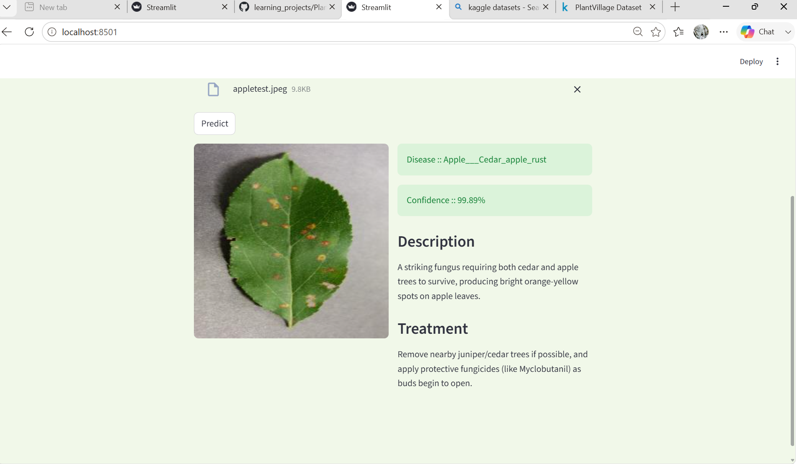

# 🌿 Plant Disease Detection using CNN

## Overview

This project is a Deep Learning-based Plant Disease Detection System built using PyTorch and Streamlit.

The model analyzes leaf images and predicts the disease affecting the plant. It also provides confidence scores, disease descriptions, and treatment recommendations through an interactive web interface.

---

## Features

* Plant disease classification using CNN
* Trained on RGB leaf images from the PlantVillage dataset
* 38 disease and healthy plant categories
* Confidence score generation using Softmax
* Disease description and treatment recommendations
* Streamlit web application for real-time predictions

---

## Dataset

Dataset: PlantVillage Dataset

* Total Images: 54,000+
* Classes: 38
* Image Type: RGB

---

## Model Architecture

The CNN architecture consists of:

* Convolutional Layers
* Batch Normalization
* ReLU Activation
* Max Pooling
* Dropout Regularization
* Fully Connected Layers

---

## Training Techniques

* Data Augmentation

  * Random Horizontal Flip
  * Random Rotation
  * Color Jitter

* Normalization

* Validation-Based Model Checkpointing

---

## Performance

Validation Accuracy: 94.67%

Validation Loss: 0.1708

---

## Technologies Used

* Python
* PyTorch
* TorchVision
* Streamlit
* Pillow

---

## Project Structure

Plantdisease_project/

├── app.py

├── inference.py

├── main.py

├── classes.py

├── best_model.pt

├── README.md

---

## How to Run

1. Clone the repository

2. Install dependencies

pip install -r requirements.txt

3. Launch the Streamlit application

streamlit run app.py

---

## Future Improvements

* Transfer Learning using ResNet50
* Mobile Deployment
* Real-time Disease Detection using Camera Input
* Multi-Disease Detection

---

## Author

Bhadri

Deep Learning | Machine Learning | Computer Vision

## Application Preview

### Home Page

### Prediction Result

